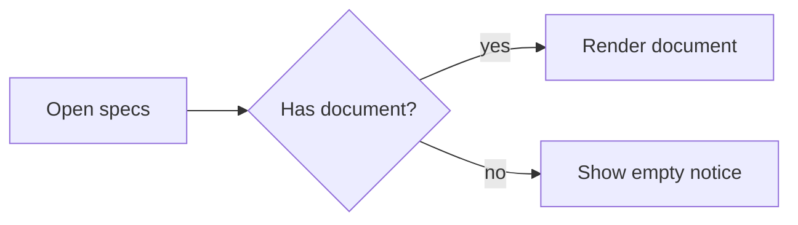

# Mermaid probe

## Flow


```mermaid
flowchart LR
  A[Open specs] --> B{Has document?}
  B -- yes --> C[Render document]
  B -- no --> D[Show empty notice]
```

## Broken

```mermaid
flowchart LR
  A --> 
```

## Code

```ts
export const answer: number = 42; // comment
```
